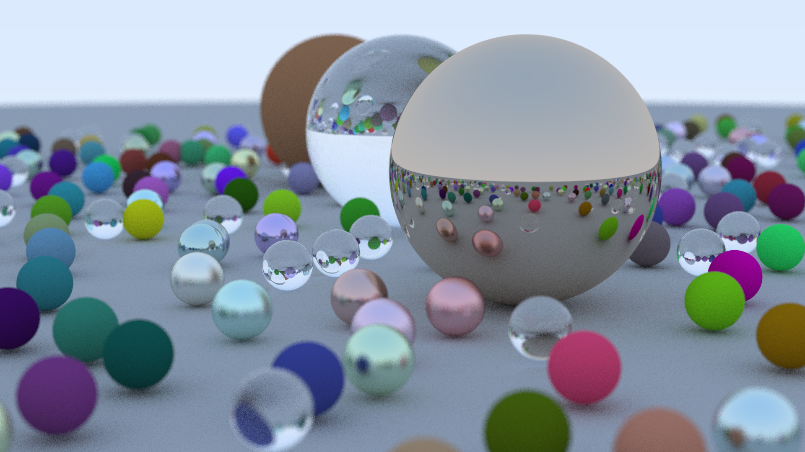

# RayTracing-Py

This is a python implementation of the [Ray Tracing in One Weekend](https://raytracing.github.io/) series.

**Note: This project is still under construction.**

**Progress: Contents within the first book has finished.**

